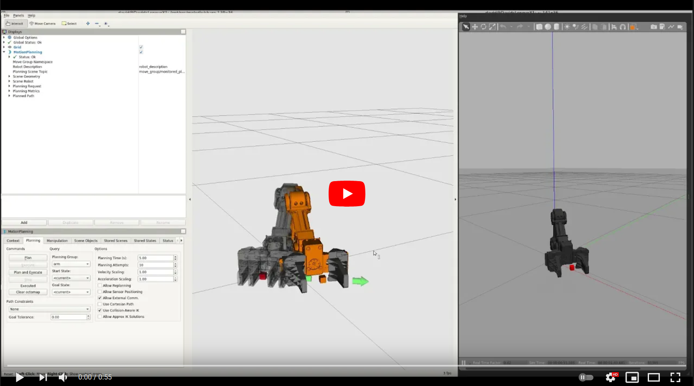
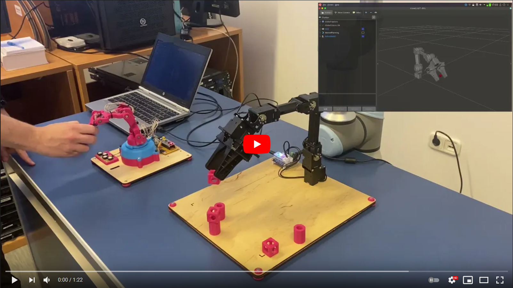
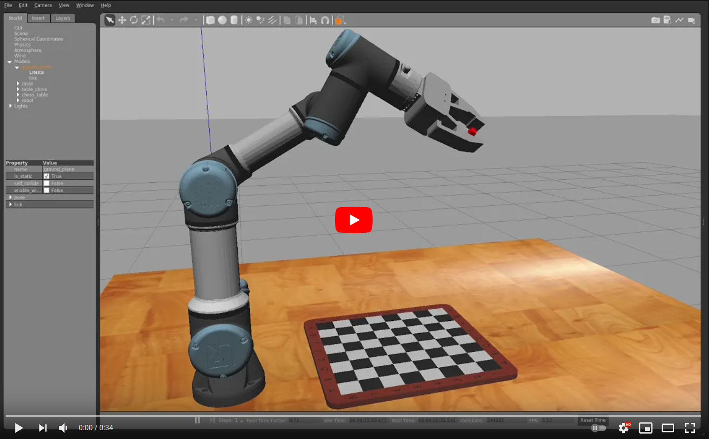
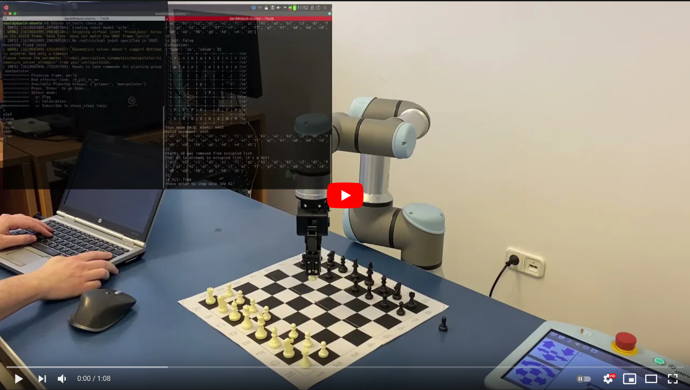

[//]: # (Image References)

[image1]: ./assets/openmanipulator_1.png "openmanipulator"
[image2]: ./assets/openmanipulator_2.png "openmanipulator"
[image3]: ./assets/openmanipulator.png "openmanipulator"
[image4]: ./assets/git_diff.png "git"
[image5]: ./assets/openmanipulator_3.png "openmanipulator"
[image6]: ./assets/openmanipulator_4.png "openmanipulator"
[image7]: ./assets/openmanipulator_5.png "openmanipulator"
[image8]: ./assets/openmanipulator_6.png "openmanipulator"
[image9]: ./assets/ik.png "openmanipulator"
[image10]: ./assets/openmanipulator_7.png "openmanipulator"
[image11]: ./assets/ur_1.png "UR3e"
[image12]: ./assets/ur_2.png "UR3e"
[image13]: ./assets/ur_3.png "UR3e"
[image14]: ./assets/ur_4.png "UR3e"
[image15]: ./assets/ur_5.png "UR3e"
[image16]: ./assets/ur_6.png "UR3e"
[image17]: ./assets/ur_7.png "UR3e"
[image18]: ./assets/ur_8.png "UR3e"
[image19]: ./assets/ur_9.png "UR3e"
[image20]: ./assets/ur_10.png "UR3e"
[image21]: ./assets/moveit_commander.gif "MoveIt commander"

# 11. - 12. hét - robotkarok

# Hova fogunk eljutni?
<a href="https://youtu.be/mm2vKYH-Jy8"></a>  
<a href="https://youtu.be/TDOdKdiD7pk"></a>  
<a href="https://youtu.be/llD6eGD8nEM"></a>  
<a href="https://youtu.be/BLvH7DzvwUk"></a>

# Tartalomjegyzék
1. [Kezdőcsomag](#Kezdőcsomag)  
2. [OpenMANIPULATOR-X](#OpenMANIPULATOR-X)  
2.1. [Első próba](#Első-próba)  
2.2. [Indítás MoveIt-tel](#Indítás-MoveIt-tel)  
2.3. [IKFast plugin](#IKFast-plugin)  
2.4. [Saját node mozgatáshoz](#Saját-node-mozgatáshoz)  
2.5. [Gazebo világba helyezés](#Gazebo-világba-helyezés)  
2.6. [Saját IK](#Saját-IK)  
3. [UR3e robotkar](#UR3e-robotkar)  
3.1. [UR3e gripperrel](#UR3e-gripperrel)  
3.2. [Gazebo világ](#Gazebo-világ) 
3.3. [SRDF fájl](#SRDF-fájl)  
3.4. [MoveIt commander](#MoveIt-commander)  

# Kezdőcsomag

A kezdőcsomag ebben az esetben csak a dokumentációt foglalja magában, mert olyan robotkarokkal fogunk foglalkozni, amik rendelkeznek hivatalos ROS csomagokkal, ezeket fogjuk letölteni és kipróbálni!

# OpenMANIPULATOR-X

Az OpenMANIPULATOR-X egy 4 szabadsági fokú robotkar, a Turtlebot 3 hivatalos manipulátora. 
![alt text][image3]

A hivatalos dokumentációja [itt](https://emanual.robotis.com/docs/en/platform/openmanipulator_x/ros_operation/) található.

Ne telepítsünk tárolóból semmilyen OpenMANIPULATOR csomagot, bár Noetic esetén amúgy sem elérhetők tárolóból.

Helyette töltsük le ezeket a git repokat:
```console
git clone https://github.com/MOGI-ROS/robotis_manipulator
git clone https://github.com/MOGI-ROS/dynamixel-workbench
git clone https://github.com/MOGI-ROS/dynamixel-workbench-msgs
git clone https://github.com/MOGI-ROS/DynamixelSDK
git clone https://github.com/MOGI-ROS/open_manipulator_controls
git clone https://github.com/MOGI-ROS/open_manipulator_simulations
git clone https://github.com/MOGI-ROS/open_manipulator_msgs
git clone https://github.com/MOGI-ROS/open_manipulator
```

Ezen kívül használni fogunk még egy gazebo plugint, amire az OpenMANIPULATOR *description*-je is hivatkozik, azonban a hivatalos dokumentációban elfelejtették megemlíteni:
```console
git clone https://github.com/roboticsgroup/roboticsgroup_gazebo_plugins
```

Fordítsuk újra a workspace-t, és máris készen állunk az első próbára.

## Első próba

3 terminál ablakra lesz szükségünk, indítsuk el a következő launch fájlokat.
```console
roslaunch open_manipulator_gazebo open_manipulator_gazebo.launch
```
Ez elindítja a Gazebo szimulációt, vegyük észre, hogy a szimuláció megállítva indul el, épp ahogy az előző leckében láttuk.
![alt text][image7]

```console
roslaunch open_manipulator_controller open_manipulator_controller.launch use_platform:=false
```
Ennek eredményeképp elindul a controller, ami innentől kezdve mozgatni tudja a szimulált karunkat, ha minden rendben ment, akkor a következőt kell látnunk a terminálban:
```console
process[open_manipulator_controller-1]: started with pid [10012]
port_name and baud_rate are set to /dev/ttyUSB0, 1000000
[INFO] Ready to simulate /open_manipulator_controller on Gazebo
```

Ez pedig elindítja az OpenMANIPULATOR grafikus vezérlőpaneljét. Indítsuk el a timert, engedélyezzük az aktuáto, majd küldjük a kart home pozícióba:
```console
roslaunch open_manipulator_control_gui open_manipulator_control_gui.launch
```
![alt text][image8]

Ha esetleg ebbe a hibába futnánk:
```console
[ERROR] [1618922478.206182640, 0.022000000]: Could not load controller 'gripper_position' because controller type 'effort_controllers/JointPositionController' does not exist.
```

Akkor telepítsük az `effort controllers` csomagot:
```console
sudo apt install ros-$(rosversion -d)-effort-controllers
```

## Indítás MoveIt-tel

Az OpenMANIPULATOR fenti iplementációja sajnos nem joint trajectory controller alapú, hanem ROS service hívásokkal tudjuk mozgatni. Ennek ugyan vannak előnyei, hiszen az OpenaMANIPULATOR rengeteg service-t kezel, többek között az inverz kinematikát is kapjuk hozzá.
```console
...
/goal_drawing_trajectory
/goal_joint_space_path
/goal_joint_space_path_from_present
/goal_joint_space_path_to_kinematics_orientation
/goal_joint_space_path_to_kinematics_pose
/goal_joint_space_path_to_kinematics_position
/goal_task_space_path
/goal_task_space_path_from_present
/goal_task_space_path_from_present_orientation_only
/goal_task_space_path_from_present_position_only
/goal_task_space_path_orientation_only
/goal_task_space_path_position_only
/goal_tool_control
...
```

Azonban az `rqt_joint_trajectory_controller`-t sem tudjuk használni vele, és a MoveIt-tel sem kompatibilis. Szerencsére épp emiatt létezik egy joint trajectory controller alapú megolás is, így most csak azzal fogunk foglalkozni, de a service alapú megoldást is próbáljátok ki nyugodtan!

A joint trajectory controller-t a következő módon tudjuk elindítani, ez egyben elindítja a szimulációt is, tehát nincs szükség más launchfájlok indítására.
```console
roslaunch open_manipulator_controllers joint_trajectory_controller.launch
```

Azonnal ki is tudjuk próbálni MoveIt-tel:

![alt text][image1]

És természetesen a `rqt_joint_trajectory_controller` is ugyanúgy működik vele, ahogy korábban láttuk:
```console
rosrun rqt_joint_trajectory_controller rqt_joint_trajectory_controller
```

MoveIt kapcsán hamar észrevesszük, hogy ugyanaz a probléma az OpenMANIPULATOR esetén is, mint az előző fejezetben a saját 4 DoF robotkarunk esetén, a MoveIt KDL pluginja nem támogatja a 6-nál kisebb szabadsági fokú karokat.

## IKFast plugin

Ennek a megoldására készítettem egy IKFast plugint, amit innen tudtok letölteni:
```console
git clone https://github.com/MOGI-ROS/open_manipulator_ikfast_plugin
```

A workspace újrafordítása után a `open_manipulator_controls/open_manipulator_moveit_config/config` mappában lévő `kinematics.yaml` fájlt módosítva tudjuk aktiválni a plugint:

Eredeti:
```yaml
arm:
  kinematics_solver: kdl_kinematics_plugin/KDLKinematicsPlugin
  kinematics_solver_search_resolution: 0.005
  kinematics_solver_timeout: 0.005
```

Módosított:
```yaml
arm:
  kinematics_solver: open_manipulator/IKFastKinematicsPlugin
  kinematics_solver_search_resolution: 0.005
  kinematics_solver_timeout: 0.005
```

A módosítást természetesen MoveIt Setup Assistant-tal is megcsinálhatjuk!

Ezután próbáljuk is ki a MoveIt-tel:
```console
roslaunch open_manipulator_controllers joint_trajectory_controller.launch
```
![alt text][image6]

## Saját node mozgatáshoz
A joint trajectory controller-nek köszönhetően a már korábban látott módon saját node-ból is egyszerűen tudjuk mozgatni a kar jointjait!

Töltsük le ehhez a következő csomagot:
```console
git clone https://github.com/MOGI-ROS/open_manipulator_tools
```

Indítsuk el a szimulációt, ahogy eddig:
```console
roslaunch open_manipulator_controllers joint_trajectory_controller.launch
```

Majd próbáljuk ki a következő node-okat:

```console
rosrun open_manipulator_tools send_joint_angles.py
rosrun open_manipulator_tools close_gripper.py
rosrun open_manipulator_tools open_gripper.py
```

## Gazebo világba helyezés

Ahhoz, hogy egy Gazebo világba helyezzük a kart, módosítsuk egy kicsit a gyári launch fájlt:  
`open_manipulator_controls/open_manipulator_hw/launch/open_manipulator_gazebo.launch`

```xml
<?xml version="1.0"?>
<launch>
  <arg name="gui" default="true"/>
  <arg name="paused" default="true"/>
  <arg name="use_sim_time" default="true"/>

  <!-- World File -->
  <arg name="world_file" default="$(find open_manipulator_tools)/worlds/world.world"/>

  <!-- Spawn z coordinate -->
  <arg name="z" default="1.02"/>

  <!-- startup simulated world -->
  <include file="$(find gazebo_ros)/launch/empty_world.launch">
    <arg name="paused" value="$(arg paused)"/>
    <arg name="gui" value="$(arg gui)"/>
    <arg name="use_sim_time" value="$(arg use_sim_time)"/>
    <arg name="world_name" value="$(arg world_file)"/>
  </include>

  <!-- Load the URDF into the ROS Parameter Server -->
  <param name="robot_description"
   command="$(find xacro)/xacro --inorder '$(find open_manipulator_description)/urdf/open_manipulator_robot.urdf.xacro'"/>

  <!-- push robot_description to factory and spawn robot in gazebo -->
  <node name="spawn_gazebo_model" pkg="gazebo_ros" type="spawn_model" respawn="false" output="screen"
    args="-urdf -param robot_description -model robot -x 0.0 -y 0.0 -z $(arg z) -Y 0.0 -J joint1 0.0 -J joint2 -1.0 -J joint3 0.3 -J joint4 0.7 -J gripper 0.0 -J gripper_sub 0.0"/>
</launch>
```
A módosítások diff-je:
![alt text][image4]

Ezután már egy egyszerű, az előző fejezethez hasonló, szimulált világban indul a kar.
![alt text][image5]

## Saját IK
Mivel az OpenMANIPULATOR-X felépítése nagyon hasonlít az előző leckében épített karhoz, kis módosítással elkészíthetjük a saját inverz kinematika számoló node-unkat. Nézzük meg az eltéréseket az előző lecke karjához képest!

![alt text][image9]

Nézzük meg működés közben, először indítsuk el a szimulációt:
```console
roslaunch open_manipulator_controllers joint_trajectory_controller.launch
```

Nyissuk ki a grippert:
```console
rosrun open_manipulator_tools open_gripper.py
```

Futtassuk az inverz kinematika node-unkat, ami adott TCP koordinátára viszi a kart.
```console
rosrun open_manipulator_tools inverse_kinematics.py
```
![alt text][image10]

# UR3e robotkar
A következő kar, amit alaposabban megnézünk egy [UR3e robotkar a Universal Robots-tól](https://www.universal-robots.com/products/ur3-robot/), ez szintén megtalálható a tanszéken. Alapesetben a kar szimulációjában nincs benne semmilyen megfogó, ezt nekünk kell majd hozzáadni.

Töltsük le a megfelelő csomagot a szimulációhoz:
```console
git clone -b calibration_devel https://github.com/dudasdavid/universal_robot
```

Fordítsuk újra a workspace-t és próbáljuk ki! Ezúttal is 3 terminálra lesz szükségünk:
```console
roslaunch ur_e_gazebo ur3e.launch limited:=true
```
Ez elindítja a Gazebo szimulációt és a joint trajectory controller-t:
![alt text][image11]

>Természetsen itt indíthatunk egy `rqt_joint_trajectory_controller`-t:
>![alt text][image18]

A következő launchfájl elindítja a MoveIt-ot:
```console
roslaunch ur3_e_moveit_config ur3_e_moveit_planning_execution.launch sim:=true limited:=true
```
A harmadik pedig megnyitja az RViz-t:
```console
roslaunch ur3_e_moveit_config moveit_rviz.launch config:=true
```
Ezután már használhatjuk is a MoveIt-ot a karral:
![alt text][image12]

Természetesen végre is hajthatjuk a szimulációban, amit a MoveIt tervezett:
![alt text][image13]

## UR3e gripperrel

Tegyünk egy grippert a UR3e-re, ehhez egy RH-P12-RN grippert fogunk használni a ROBOTIS-tól, a tanszéken található UR3e is ezzel a gripperrel van felszerelve. Elég sok helyen kell módosítanunk a gyári csomagokat, ezért használjunk most egy olyan branchet, ahol ez már be is van állítva!

Menjünk a `src/universal_robot` mappába és:
```console
git checkout rh-p12-rn
```

A gripper miatt töltsük le még a következő csomagokat is:
```console
git clone -b ur3e-gripper https://github.com/dudasdavid/RH-P12-RN-A
git clone https://github.com/ROBOTIS-GIT/ROBOTIS-Framework
git clone https://github.com/ROBOTIS-GIT/ROBOTIS-Framework-msgs
```

Természetesen fordítsuk újra a workspace-t!

A `rh-p12-rn` branchen pontosan ugyanúgy kell elindítanunk a szimulációt, mint az előbb:

```console
roslaunch ur_e_gazebo ur3e.launch limited:=true
```
Ezzel elindul a Gazebo szimuláció, ahol ezúttal már a gripper is része a modellünknek:
![alt text][image14]

Elindítjuk a MoveIt-ot, ahogy az előbb:
```console
roslaunch ur3_e_moveit_config ur3_e_moveit_planning_execution.launch sim:=true limited:=true
```

És végül az RViz-t:
```console
roslaunch ur3_e_moveit_config moveit_rviz.launch config:=true
```
![alt text][image15]

A MoveIt-ban, a már korábban látottakhoz hasonlóan, átválthatunk a gripper planning group-jára, és például bezárhatjuk azt:
![alt text][image16]

Ami természetesen a szimulációban is megtörténik:
![alt text][image17]

## Gazebo világ

Az `rh-p12-rn` branchen korábban módosítottam a `/universal_robot/ur_e_gazebo/launch/ur3e.launch` fájlt, így argumentumként megadhatjuk a Gazebo világot és a robot z koordinátáját!

Töltsük be az előző lecke világát!
```console
roslaunch ur_e_gazebo ur3e.launch limited:=true world_file:='$(find bme_ros_simple_arm)/worlds/world.world' z:=1.04 yaw:=-1.5707
```
![alt text][image19]

## SRDF fájl
Ha elindítjuk a szimulációt és a MoveIt-et az Rviz-zel együtt, akkor a planning grouphoz, akkor láthatunk néhány előre definiált pozíciót:
![alt text][image20]

Ezeket megadhatjuk a MoveIt Setup Assistant segítségével, vagy az [SRDF](http://wiki.ros.org/srdf) fájl szerkesztésével: `/universal_robot/ur3_e_moveit_config/config/ur3e.srdf`.

## MoveIt commander
A MoveIt commander segítségével a saját node-unkból tudjuk használni a MoveIt API-ját. Természetesen elérhető C++-hoz és Pythonhoz is. A MoveIt commander használatához telepítsük fel tárolóból:
```console
sudo apt install ros-melodic-moveit-commander
```

A használatához készítsünk egy új ROS csomagot és ebben fogjuk létrehozni a saját node-unkat:

```console
catkin_create_pkg ur_moveit_commander roscpp rospy
```

Készítsünk egy `scripts` mappát a csomagba és hozzuk létre a `ur_moveit_commander.py` fájlt, ne felejtsük el futatthatóvá tenni!

A fájl tartalma legyen a következő:
```python
#!/usr/bin/env python

import sys
import time
import rospy
import moveit_commander
import moveit_msgs.msg
from moveit_commander.conversions import pose_to_list
import geometry_msgs.msg
from trajectory_msgs.msg import JointTrajectoryPoint, JointTrajectory

def all_close(goal, actual, tolerance):
  """
  Convenience method for testing if a list of values are within a tolerance of their counterparts in another list
  @param: goal       A list of floats, a Pose or a PoseStamped
  @param: actual     A list of floats, a Pose or a PoseStamped
  @param: tolerance  A float
  @returns: bool
  """
  all_equal = True
  if type(goal) is list:
    for index in range(len(goal)):
      if abs(actual[index] - goal[index]) > tolerance:
        return False

  elif type(goal) is geometry_msgs.msg.PoseStamped:
    return all_close(goal.pose, actual.pose, tolerance)

  elif type(goal) is geometry_msgs.msg.Pose:
    return all_close(pose_to_list(goal), pose_to_list(actual), tolerance)

  return True

class MoveGroupPythonInteface(object):
  """MoveGroupPythonInteface"""
  def __init__(self):

    ## First initialize `moveit_commander`_ and a `rospy`_ node:
    moveit_commander.roscpp_initialize(sys.argv)
    rospy.init_node('move_group_python_interface', anonymous=True)

    ## Instantiate a `RobotCommander`_ object. Provides information such as the robot's
    ## kinematic model and the robot's current joint states
    robot = moveit_commander.RobotCommander()

    ## Instantiate a `PlanningSceneInterface`_ object.  This provides a remote interface
    ## for getting, setting, and updating the robot's internal understanding of the
    ## surrounding world:
    scene = moveit_commander.PlanningSceneInterface()

    ## Instantiate a `MoveGroupCommander`_ object.  This object is an interface
    ## to a planning group (group of joints).  In this tutorial the group is the primary
    ## arm joints in the Panda robot, so we set the group's name to "panda_arm".
    ## If you are using a different robot, change this value to the name of your robot
    ## arm planning group.
    ## This interface can be used to plan and execute motions:
    group_name = "manipulator"
    move_group = moveit_commander.MoveGroupCommander(group_name)

    # Create a publisher for the Gazebo simulated gripper
    gazebo_publisher = rospy.Publisher('/gripper_gazebo_controller/command', JointTrajectory, queue_size=1)

    # Getting Basic Information
    # We can get the name of the reference frame for this robot:
    planning_frame = move_group.get_planning_frame()
    print "============ Planning frame: %s" % planning_frame

    # We can also print the name of the end-effector link for this group:
    eef_link = move_group.get_end_effector_link()
    print "============ End effector link: %s" % eef_link

    # We can get a list of all the groups in the robot:
    group_names = robot.get_group_names()
    print "============ Available Planning Groups:", robot.get_group_names()

    # Gazebo gripper
    self.gazebo_trajectory_command = JointTrajectory()
    self.gazebo_trajectory_command.joint_names = ["gripper"]
    self.gazebo_trajectory_point = JointTrajectoryPoint()
    self.gazebo_trajectory_point.time_from_start = rospy.rostime.Duration(1,0)
    self.gazebo_trajectory_point.velocities = [0.0]

    # Misc variables
    self.robot = robot
    self.scene = scene
    self.move_group = move_group
    self.planning_frame = planning_frame
    self.eef_link = eef_link
    self.group_names = group_names
    self.gazebo_publisher = gazebo_publisher

  def set_gripper(self, status):
      if status == "open":
        # Gazebo gripper value
        self.gazebo_trajectory_point.positions = [0.0]
      else:
        self.gazebo_trajectory_point.positions = [1.135]

      # Publish gazebo gripper position
      self.gazebo_trajectory_command.header.stamp = rospy.Time.now()
      self.gazebo_trajectory_command.points = [self.gazebo_trajectory_point]
      self.gazebo_publisher.publish(self.gazebo_trajectory_command)

  def go_to_joint_angles(self, joint_goals):

    ## Planning to a Joint Goal
    ## The UR's zero configuration is at a `singularity <https://www.quora.com/Robotics-What-is-meant-by-kinematic-singularity>`_ so the first
    ## thing we want to do is move it to a slightly better configuration.
    # We can get the joint values from the group and adjust some of the values:
    joint_goal = self.move_group.get_current_joint_values()
    joint_goal[0] = joint_goals[0]
    joint_goal[1] = joint_goals[1]
    joint_goal[2] = joint_goals[2]
    joint_goal[3] = joint_goals[3]
    joint_goal[4] = joint_goals[4]
    joint_goal[5] = joint_goals[5]

    # The go command can be called with joint values, poses, or without any
    # parameters if you have already set the pose or joint target for the group
    self.move_group.go(joint_goal, wait=True)

    # Calling ``stop()`` ensures that there is no residual movement
    self.move_group.stop()

    # For testing:
    current_joints = self.move_group.get_current_joint_values()
    return all_close(joint_goal, current_joints, 0.01)

  def go_to_pose(self, x, y, z):
    ## Planning to a Pose Goal
    ## We can plan a motion for this group to a desired pose for the
    ## end-effector:
    pose_goal = geometry_msgs.msg.Pose()
    # set proper quaternion for the vertical orientation: https://quaternions.online/
    pose_goal.orientation.x = -0.383 # -1
    pose_goal.orientation.y = 0.924
    
    pose_goal.position.x = x
    pose_goal.position.y = y
    pose_goal.position.z = z

    self.move_group.set_pose_target(pose_goal)

    ## Now, we call the planner to compute the plan and execute it.
    plan = self.move_group.go(wait=True)
    # Calling `stop()` ensures that there is no residual movement
    self.move_group.stop()
    # It is always good to clear your targets after planning with poses.
    # Note: there is no equivalent function for clear_joint_value_targets()
    self.move_group.clear_pose_targets()

    # For testing:
    # Note that since this section of code will not be included in the tutorials
    # we use the class variable rather than the copied state variable
    current_pose = self.move_group.get_current_pose().pose
    return all_close(pose_goal, current_pose, 0.01)

  def go_to_named_target(self, name):
    self.move_group.set_named_target(name)

    ## Now, we call the planner to compute the plan and execute it.
    plan = self.move_group.go(wait=True)

    # Calling ``stop()`` ensures that there is no residual movement
    self.move_group.stop()

def main():
  try:

    moveit_commander = MoveGroupPythonInteface()

    # Set max velocity
    moveit_commander.move_group.set_max_velocity_scaling_factor(0.2)
    # Set tolerances, without that IK cannot do a valid plan
    moveit_commander.move_group.set_goal_position_tolerance(0.0005)
    moveit_commander.move_group.set_goal_orientation_tolerance(0.001)

    time.sleep(2)
    
    raw_input("============ Press `Enter` to go joint angles...")
    moveit_commander.go_to_joint_angles([-1.5708, -1.5708, -1.0472, -1.0472, 1.5708, 0.7854])

    raw_input("============ Press `Enter` to close gripper...")
    moveit_commander.set_gripper("closed")

    raw_input("============ Press `Enter` to go to X,Y,Z coordinates...")
    moveit_commander.go_to_pose(0.3, 0.2, 0.2)

    raw_input("============ Press `Enter` to open gripper...")
    moveit_commander.set_gripper("open")

    raw_input("============ Press `Enter` to go up position...")
    moveit_commander.go_to_named_target("up")

  except rospy.ROSInterruptException:
    return
  except KeyboardInterrupt:
    return

if __name__ == '__main__':
  main()
```

Fordítsuk újra a workspace-t, majd `source devel/setup.bash`!

Indítsuk el a szimulációt:
```console
roslaunch ur_e_gazebo ur3e.launch limited:=true
```

A MoveIt-ot:
```console
roslaunch ur3_e_moveit_config ur3_e_moveit_planning_execution.launch sim:=true limited:=true
```

És az új node-unkat:
```console
rosrun ur_moveit_commander ur_moveit_commander.py
```

![alt text][image21]

A MoveIt commander node-unk alapja a [Move Group Python Interface tutorial](https://ros-planning.github.io/moveit_tutorials/doc/move_group_python_interface/move_group_python_interface_tutorial.html), így javaslom annak a végigcsinálását is annak, aki szeretne ezzel részletesebben foglalkozni!
